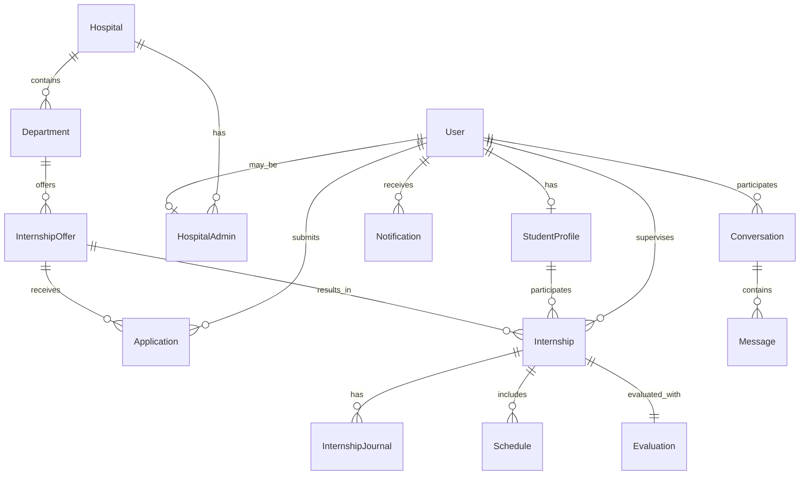

###  6.1 Entity-Relationship Overview

  

```mermaid

erDiagram

User ||--o| StudentProfile : "has"

User ||--o| HospitalAdmin : "may_be"

Hospital ||--o{ HospitalAdmin : "has"

Hospital ||--o{ Department : "contains"

Department ||--o{ InternshipOffer : "offers"

InternshipOffer ||--o{ Application : "receives"

InternshipOffer ||--o{ Internship : "results_in"

User ||--o{ Application : "submits"

StudentProfile ||--o{ Internship : "participates"

User ||--o{ Internship : "supervises"

Internship ||--o{ InternshipJournal : "has"

Internship ||--o{ Schedule : "includes"

Internship ||--|| Evaluation : "evaluated_with"

User ||--o{ Notification : "receives"

User ||--o{ Conversation : "participates"

Conversation ||--o{ Message : "contains"

```
